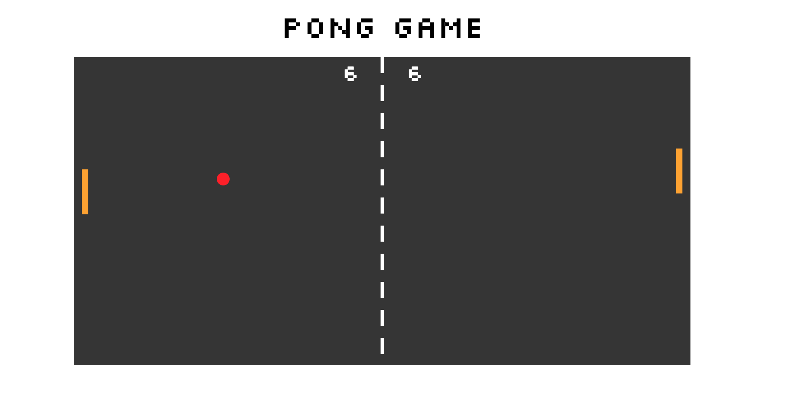
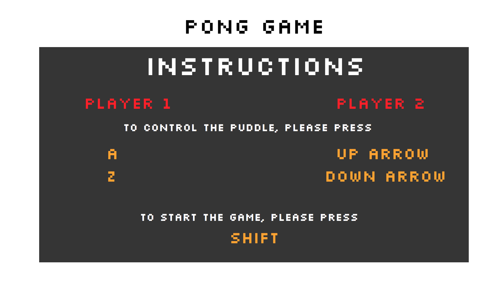
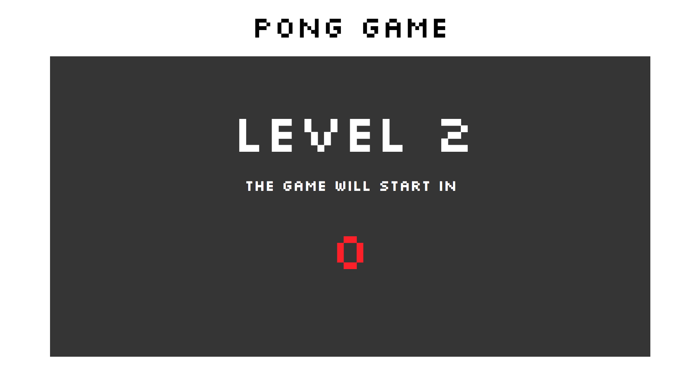
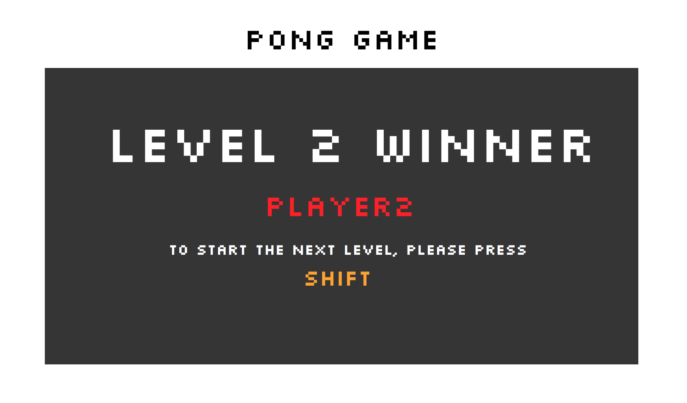
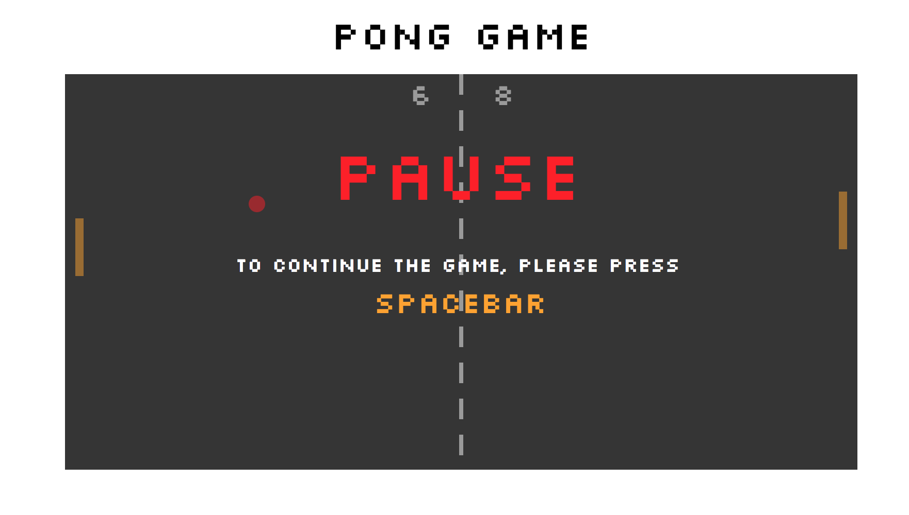
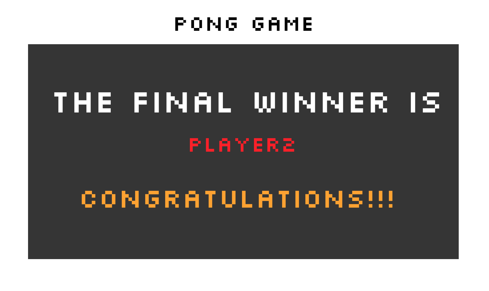

# Pong Game

This is a basic pong game using SVGs. Two players can control paddles by using keys:

**Player 1:**
* a: up
* z: down

**Player 2:**
* ▲: up
* ▼: down

## Features

* Board size: 768px x 384px.

* The ball hits a paddle with a sound.

* The game starts with an opening screen with instructions for players. They can start the game by pressing the Shift key:

* The game has 3 levels that differ in the speed of the ball: 8, 10 and 12. Each level ends when one of the players gets 10 points.

* Before the beginning of each level, players see a screen with a level number and a countdown starting at 5.

* After the end of each level, players see a screen with the name of the current level winner. They can continue the game by pressing the Shift key.

* Players can pause the game by pressing the Spacebar. When the game is paused, players cannot move paddles, the ball stops where it was when the Spacebar was pressed, and all the board is darkened. Players see a screen telling them that the game is paused. They can continue the game by pressing the Spacebar again.

* After the 3rd level, the game ends. Players see the screen with the name of the winner of the whole game round. The winner of the game is the player who won in two levels of three.

